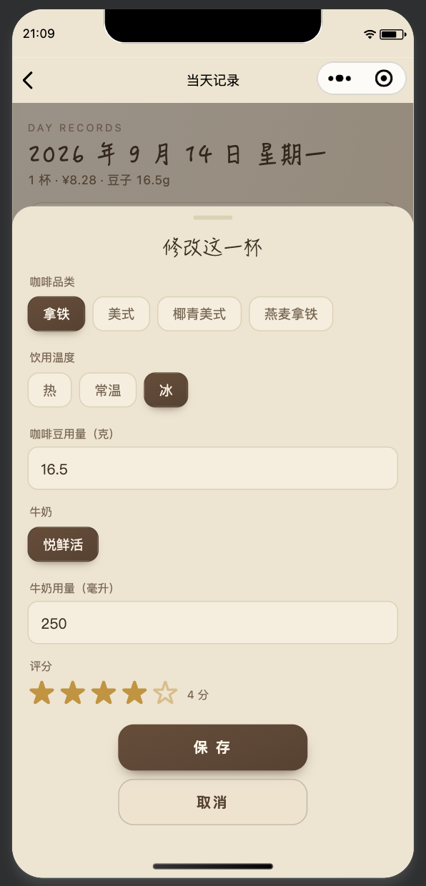
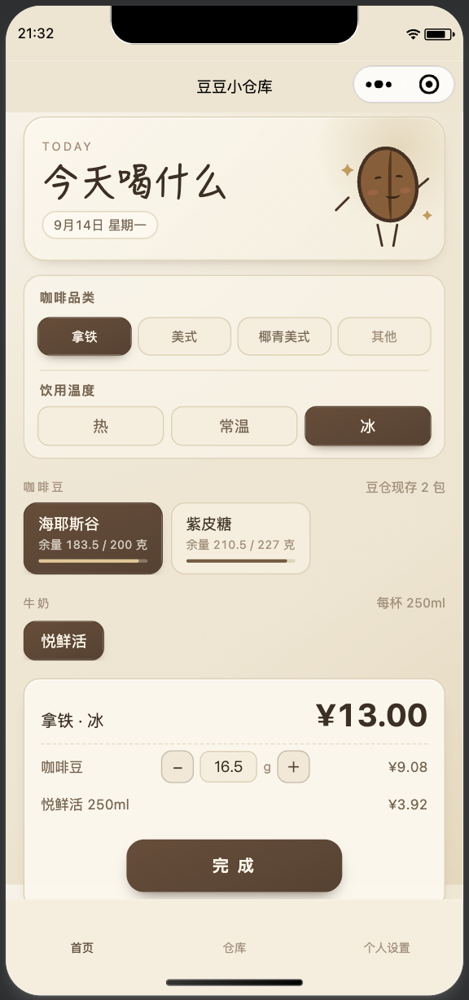
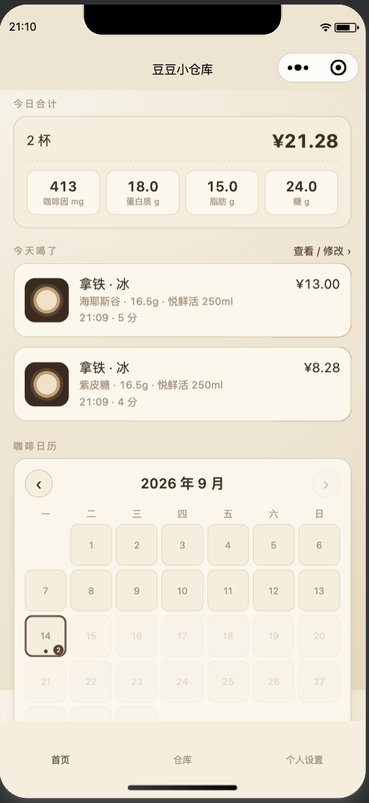
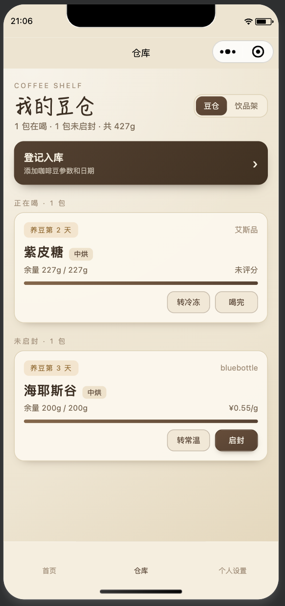

# 豆豆小仓库 ☕

一个只给自己用的咖啡记账本 —— 记录每天喝的咖啡，管理咖啡豆和辅料库存，自动算成本和营养。原生微信小程序，TypeScript 开发，数据存在手机本地，不需要服务器。

<p align="center">
  
  
  
  
</p>

📱 **[点击查看界面演示](https://judy-1003.github.io/doudou-warehouse/demo.html)** —— 网页还原版，不用装微信开发者工具也能看效果

📄 [查看项目介绍页](https://judy-1003.github.io/doudou-warehouse/)

## 这是什么

自己每天喝手冲/奶咖，想知道：这一杯多少钱、多少咖啡因、家里的豆子还能喝几天、牛奶还剩多少。市面上的记账小程序都不是给咖啡用的，所以自己写了一个。

核心是三件事：

1. **记一杯** —— 选品类（拿铁/美式/自定义）、选温度（热/常温/冰）、选豆子、选辅料，自动算钱和营养，一键保存。
2. **管库存** —— 咖啡豆和牛奶/椰子水都有余量，喝一杯扣一杯，删记录会自动归还。
3. **看统计** —— 每天/每周/每月喝了多少、花了多少钱，日历一目了然，点哪天都能查看和改。

## 功能一览

### 首页 —— 今天喝什么

- 品类胶囊选择（拖拽排序后的前 3 个 + "其他"），温度单独选（热 / 常温 / 冰）
- 咖啡豆按余量比例显示进度条，选中后自动扣库存
- 用豆量支持现场加减或直接输入，不用去设置改默认值
- 辅料（牛奶/椰子水/自定义饮品）联动库存，扣完会提示余量不足
- 保存时自动拍照、评分，成本和咖啡因/蛋白质/脂肪/糖分实时算好
- 今日合计卡片汇总当天所有杯数
- 咖啡日历：小圆点标记有记录的日期，点进去能看那天的所有记录并支持左滑删除/修改
- 当天记录列表左滑出现删除按钮，删除会把用掉的豆子和辅料**自动归还**回库存

### 仓库 —— 豆仓 / 饮品架

- 豆仓按"正在喝 / 未启封 / 已归档"分组，每包豆子显示余量进度条、赏味期状态、预计还能喝几天
- 长按咖啡豆或辅料卡片可以直接删除
- 未启封的豆子可以直接"转常温 / 转冷冻 / 启封"，在喝的豆子随时能切换存放方式
- 饮品架每个物料显示余量和大概还能做几杯，一键"补满"恢复到整瓶容量
- 所有操作都有 5 秒撤销浮条，防手滑

### 个人设置

- **咖啡品类管理**：长按拖拽排序，前 3 个直接展示在首页，其余收进"其他"
- **默认消耗量**：豆子每次用多少克、牛奶/椰子水每次用多少毫升
- **豆子清单**：只看喝过的豆子，含杯数和评分
- **数据统计**：周/月/年三种视角，看花费、豆子消耗、日均用量，每日明细可直接跳转查看/修改当天记录
- **初始化数据**：支持"只清空记录"（保留豆仓和饮品架，用掉的物料自动归还）或"全部初始化"（恢复出厂设置）

### 每一包豆子的详情页

- 完整生命周期时间线：烘焙日、配送到手、开封、养豆结束、赏味期截止、喝完
- 余量可以手动改（比如买了新豆子直接加进去，或者手动校正）
- 主观评价和五星打分
- 这包豆子泡过的每一杯记录，点进去能跳到那一天

## 技术实现

- 原生微信小程序（TypeScript + WXML + WXSS），微信开发者工具直接导入即可运行
- 数据全部存在 `wx.setStorageSync` 本地缓存里，不需要服务器和后端配置，第一次打开自动初始化默认数据
- 核心业务逻辑抽成独立模块，方便复用和以后切换成云开发：
  - `miniprogram/services/storage.ts` —— 本地数据读写、初始化、全量重置
  - `miniprogram/services/logs.ts` —— 记录的增删改，以及配套的库存归还/扣减逻辑
  - `miniprogram/utils/calculations.ts` —— 金额、营养、咖啡因、日期、统计相关的所有计算函数
  - `miniprogram/models/index.ts` —— 全部 TypeScript 数据类型定义
- 两个自定义组件：`coffee-mascot`（咖啡豆吉祥物插画）、`star-rating`（支持半星的评分组件）

### 页面结构

| 页面 | 作用 |
|---|---|
| `pages/home` | 首页：记一杯、今日合计、咖啡日历 |
| `pages/warehouse` | 仓库：豆仓 + 饮品架 |
| `pages/settings` | 个人设置入口 |
| `pages/bean-form` | 登记入库（新增咖啡豆） |
| `pages/drink-form` | 添加饮品（新增辅料） |
| `pages/categories` | 咖啡品类管理，支持拖拽排序 |
| `pages/defaults` | 默认消耗量设置 |
| `pages/bean-list` | 豆子清单 |
| `pages/bean-detail` | 单包豆子详情，余量修改、存放方式切换 |
| `pages/day-logs` | 某一天的记录列表，支持左滑删除/修改 |
| `pages/statistics` | 周/月/年统计，每日明细 |

## 快速开始

1. 打开微信开发者工具，选择"导入项目"
2. 目录选择本仓库根目录（`doudou-warehouse`），**不要**只选 `miniprogram` 子目录
3. 首次打开需要在"隐私保护指引"里声明相机/相册用途（用于拍咖啡照片）
4. 编译后先去"仓库"登记一包咖啡豆，再回首页记第一杯

想上传到微信正式发布，需要把 `project.config.json` 里的 AppID 换成你自己申请的小程序 AppID，并在微信公众平台完成小程序备案。

## 数据说明（重要）

- 数据存在**当前设备**的微信本地缓存里，换手机或清除小程序数据会导致数据丢失，不会自动同步。
- 照片保存在小程序本地文件目录，同样不会跨设备同步。
- 想要多设备同步或多人共用，需要接入微信云开发（数据库 + 云存储），代码结构已经把持久化逻辑单独抽成了 `services/storage.ts`，替换起来改动量不大，但目前版本还没做。

## 目录结构

```
doudou-warehouse/
├── miniprogram/
│   ├── app.json / app.ts / app.wxss     # 小程序入口配置
│   ├── components/                      # 自定义组件
│   ├── models/                          # TypeScript 数据类型
│   ├── pages/                           # 11 个页面
│   ├── services/                        # 本地持久化 + 记录管理
│   └── utils/                           # 计算工具函数
├── project.config.json                  # 微信开发者工具项目配置
├── tsconfig.json
└── package.json
```
